<p align="center">
  
</p>

<h1 align="center">ECHOES</h1>

<p align="center">
  A music player for Windows that is also a theme designer, a music-video viewer, a small DAW
  and an osu!-style rhythm game built from your own library.
</p>

<p align="center">
  <a href="LICENSE"></a>
  
  
  
  <a href="README.ru.md"></a>
</p>

<p align="center">
  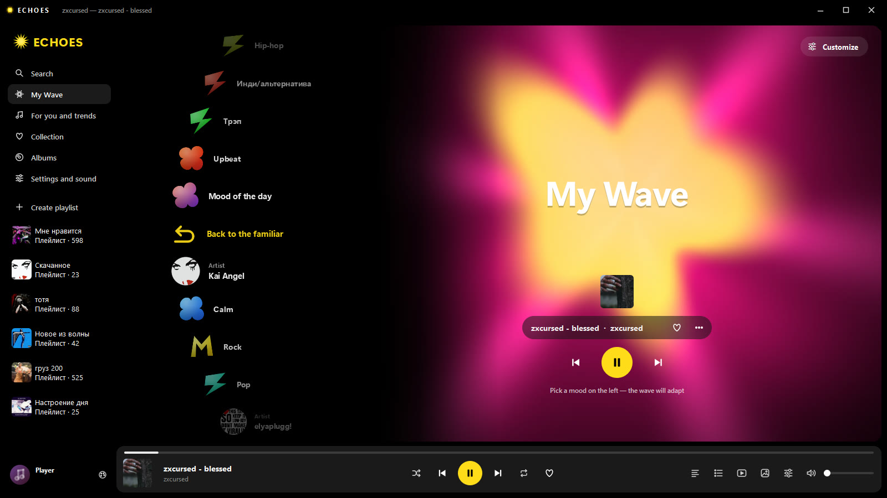
</p>

## Features

**Player**
- Local library with covers, tags, playlists, queue, shuffle/repeat and listening stats.
- Gapless playback through its own low-latency audio output, a 10-band equalizer and a volume boost up to 10 000 %.
- “My Wave”: endless recommendations from your own collection by mood, activity and language.
- Downloads from YouTube, YouTube Music and SoundCloud (and Spotify links with spotDL).
- Synced lyrics: search, an `.lrc` editor and automatic timing.
- Global hotkeys, window aspect presets (16:9, 4:3, 21:9…), Discord Rich Presence.
- Share a playlist as a small file — tracks your friend doesn't have are downloaded for them.
- Interface in **English** and **Russian**.

**Themes** — Echoes Music, Vinyl glass, Fluid, Fluid Dark, Winamp, plus your own.

| | |
|---|---|
| 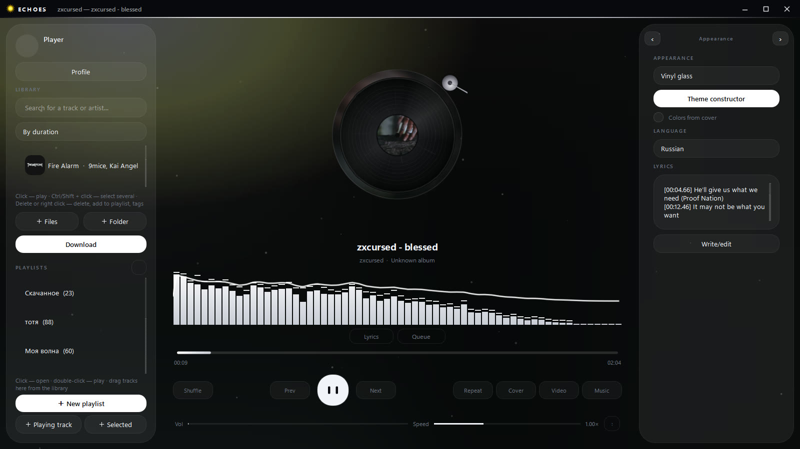 | 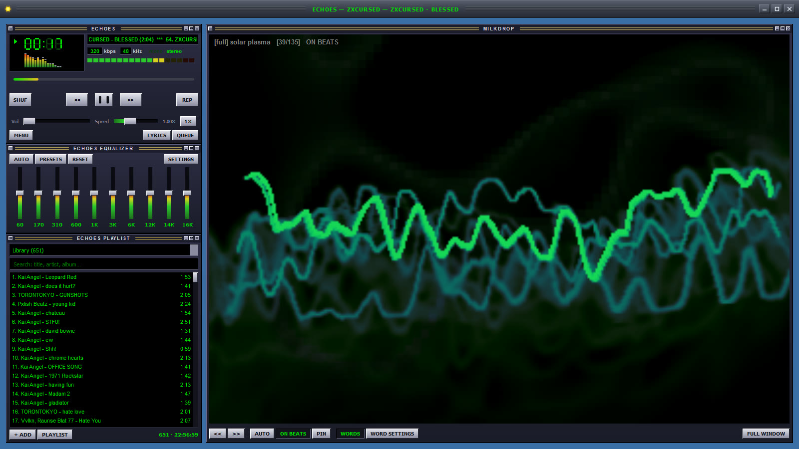 |
| 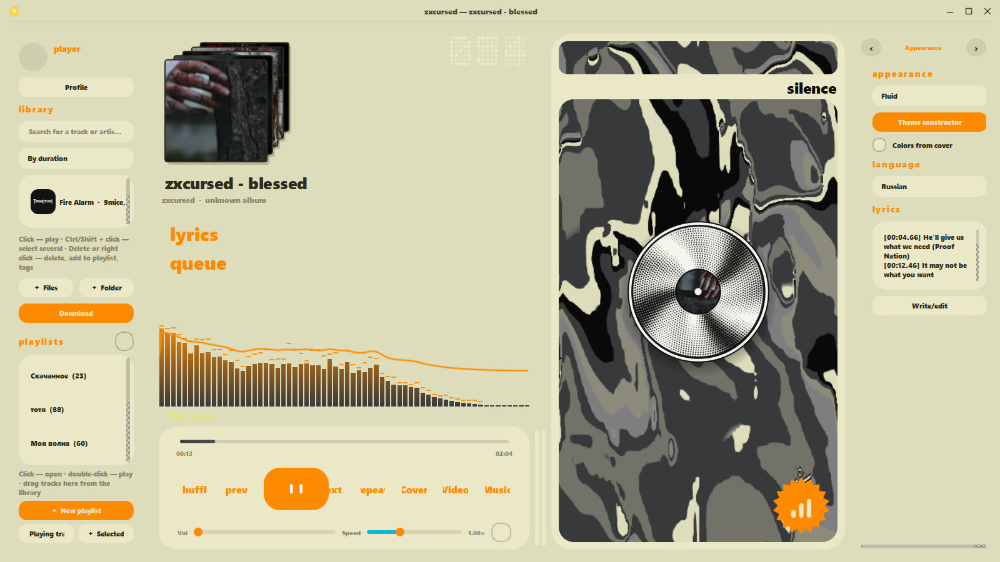 | 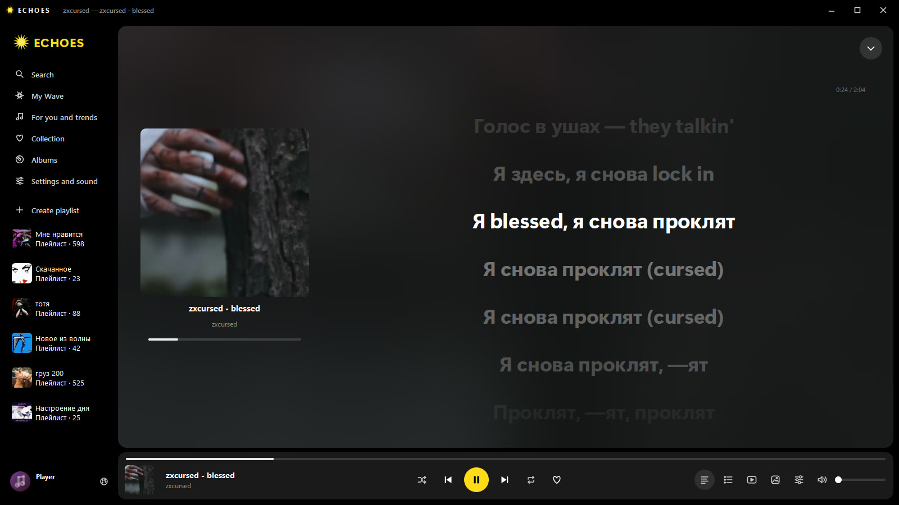 |

**Theme constructor** — build a theme with the mouse: backgrounds (image, GIF, video, live wallpapers),
layers, ready widgets, particles and screen effects, a custom record image, background removal that
works offline, and **EchoScript** — a small scripting language for animated layers and widgets.

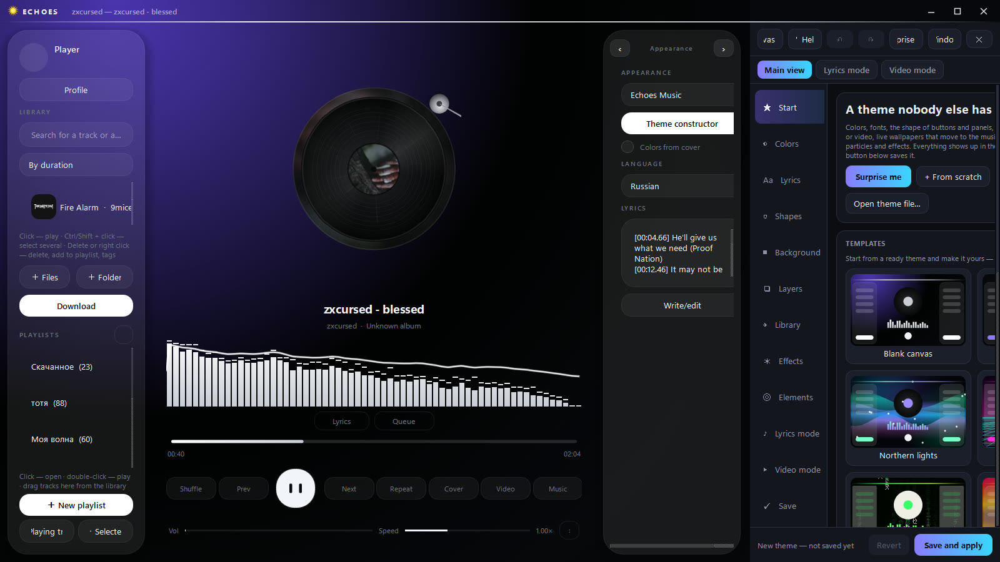

**Music videos** — the official video of the playing song, synced to the music, with a mixer
(music / video sound) and psychedelic effects. Videos can also be used as a background.

| | |
|---|---|
| 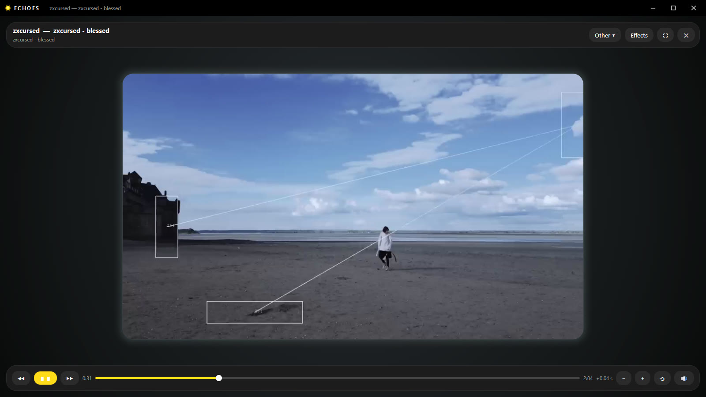 | 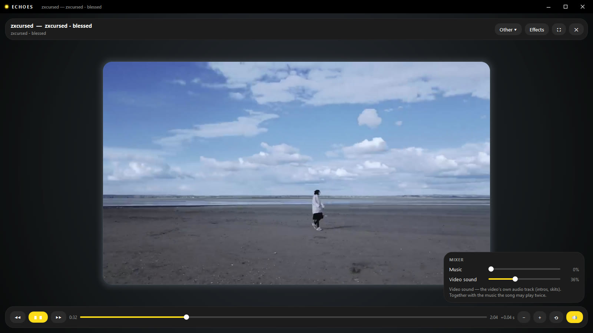 |

**Echoes Studio** — playlist, channel rack, piano roll, mixer with effects (EQ, compressor, reverb,
delay, autotune, vocoder…), instruments (synth, supersaw, keys, FM, 808, sampler), microphone
recording and a **mashup bot** that puts the vocals of one track over the beat of another.

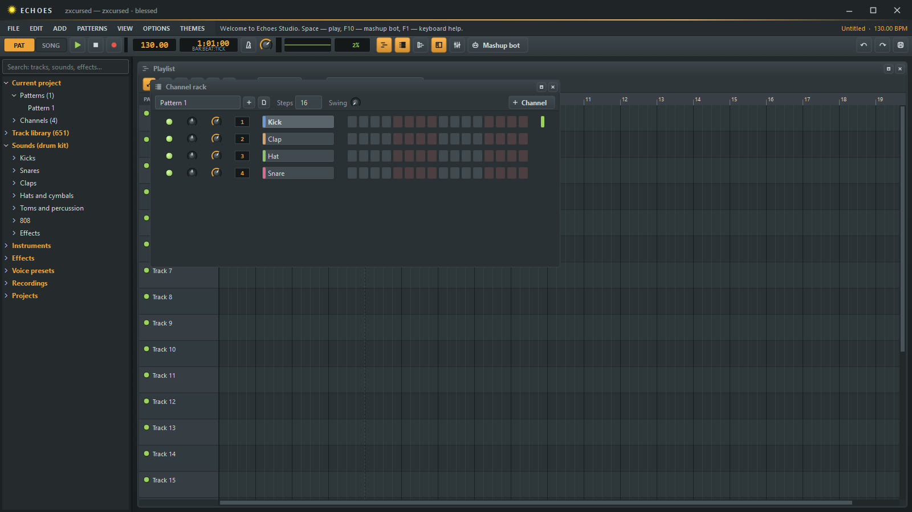

**esu!** — an osu!-style rhythm game inside the player:
- maps are generated from **any track** of your library by a model that listens to beats, sections and choruses;
- imports real osu! beatmaps (`.osz`) and skins (`.osk`), including combo bursts, spinner and HP-bar elements, cursor smoke;
- song select, mods, replays, local scores, attempts, a map editor, custom hitsounds;
- raw input, and sensitivity conversion from Roblox, CS2, Valorant, Fortnite and other games;
- a classic look close to osu! and a minimal Y2K style.

| | |
|---|---|
| 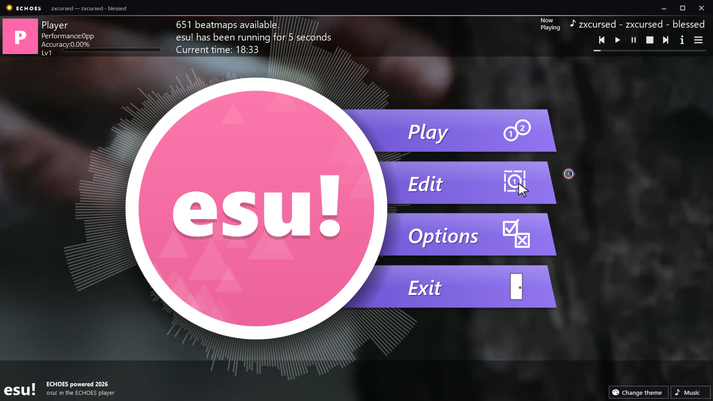 | 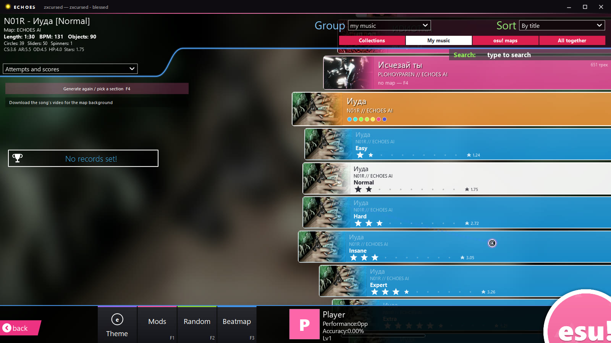 |
| 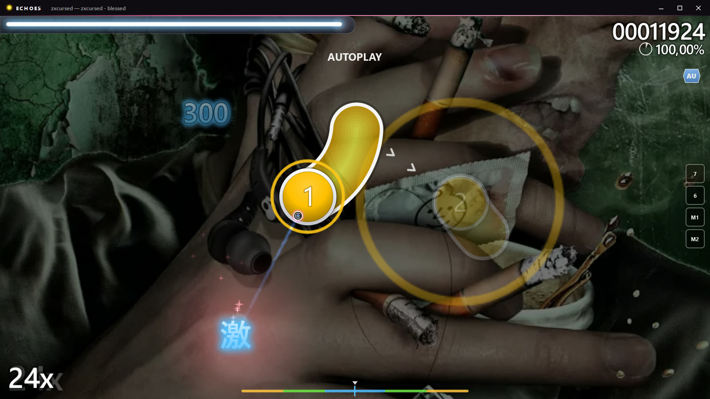 | 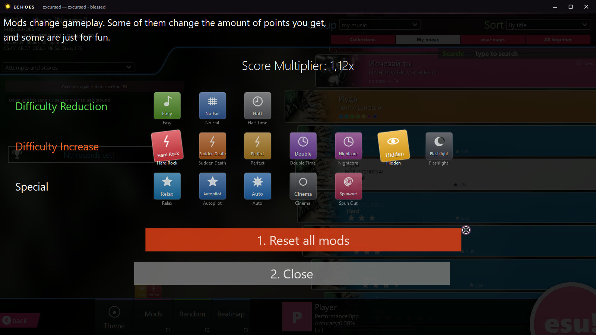 |

> esu! is a fan project and is not affiliated with osu! or ppy Pty Ltd. No osu! assets are included —
> see [THIRD_PARTY_NOTICES.md](THIRD_PARTY_NOTICES.md).

## Install

Requirements: Windows 10 or 11 (64-bit), an internet connection during setup, about 1 GB of free space.
Administrator rights are **not** needed.

1. Download the repository as ZIP (**Code → Download ZIP**) or a release archive and extract it **completely**.
2. Run **`install.bat`**. If Windows SmartScreen appears, click *More info → Run anyway*.
3. Press Enter and wait 5–15 minutes. The installer downloads and sets up its own Python, all libraries,
   VLC and ffmpeg, and creates Desktop and Start menu shortcuts.

**Update:** extract the new version and run **`update.bat`** — your library, playlists and settings are kept.
**Uninstall:** Start → ECHOES → *Удалить ECHOES* (uninstall), or Settings → Apps → ECHOES.

| What | Where |
|---|---|
| Program | `%LOCALAPPDATA%\Programs\ECHOES` |
| Your data (library, playlists, settings, covers, maps) | `%USERPROFILE%\.neon_player` |
| Setup log | `%LOCALAPPDATA%\Programs\ECHOES\setup.log` |

## Run from source

```bat
py -3.12 -m venv .venv
.venv\Scripts\activate
pip install -r requirements.txt
python app\main.py
```

You also need **VLC 3.x (64-bit)** installed (or `ECHOES_VLC_DIR` pointing to a portable VLC folder) and
**ffmpeg** on `PATH`.

### Optional keys

| Variable | What it enables |
|---|---|
| `ECHOES_DISCORD_CLIENT_ID` | Discord Rich Presence — the *Application ID* of your app in the [Discord Developer Portal](https://discord.com/developers/applications) |
| `ECHOES_SPOTIFY_CLIENT_ID`, `ECHOES_SPOTIFY_CLIENT_SECRET` | your own Spotify API keys for spotDL (without them spotDL uses its defaults) |

## Project layout

```
app/          the program (Python, PyQt6); main.py is the entry point
setup/        install.ps1, update.ps1, uninstall.ps1 (used by install.bat / update.bat)
docs/         screenshots
```

Language: the interface is written in Russian; English is provided by `app/i18n.py` with the
dictionaries `i18n_en.py` and `i18n_en_extra.py`. Switch it in Settings → *Language*.

## License

ECHOES is free software under the **GNU General Public License v3.0** — see [LICENSE](LICENSE).
Third-party components and their licenses: [THIRD_PARTY_NOTICES.md](THIRD_PARTY_NOTICES.md).
Download only music and videos you have the right to.
